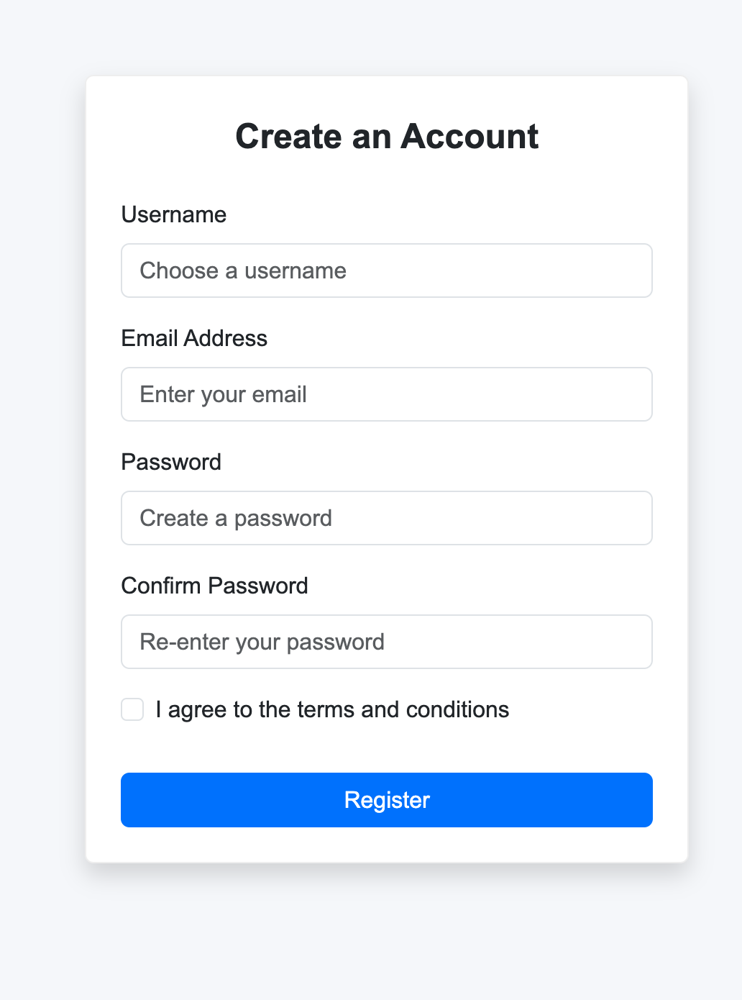
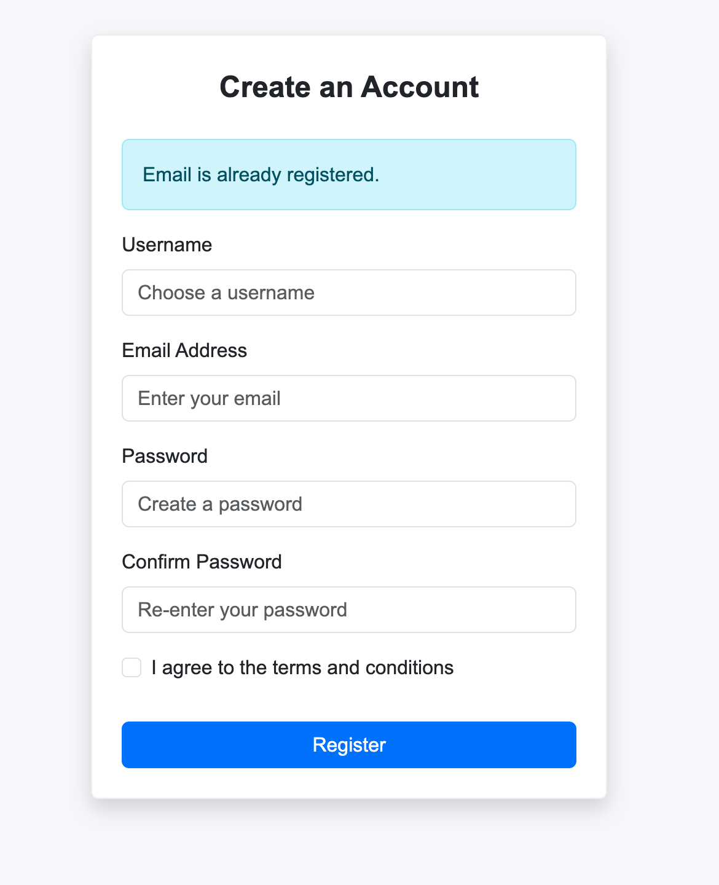
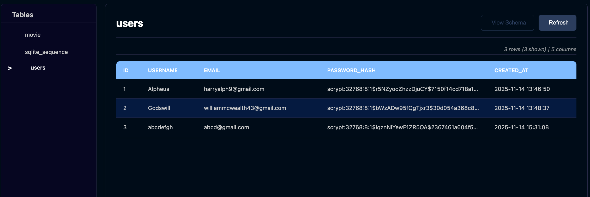
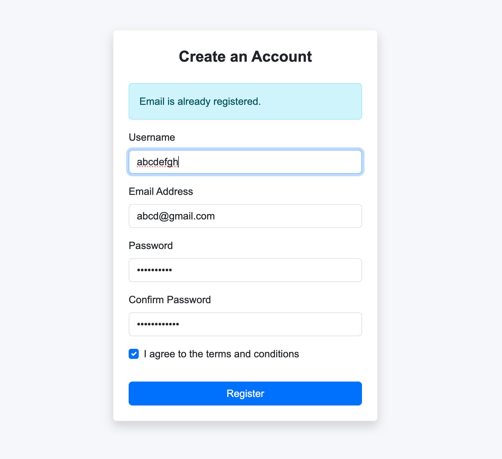
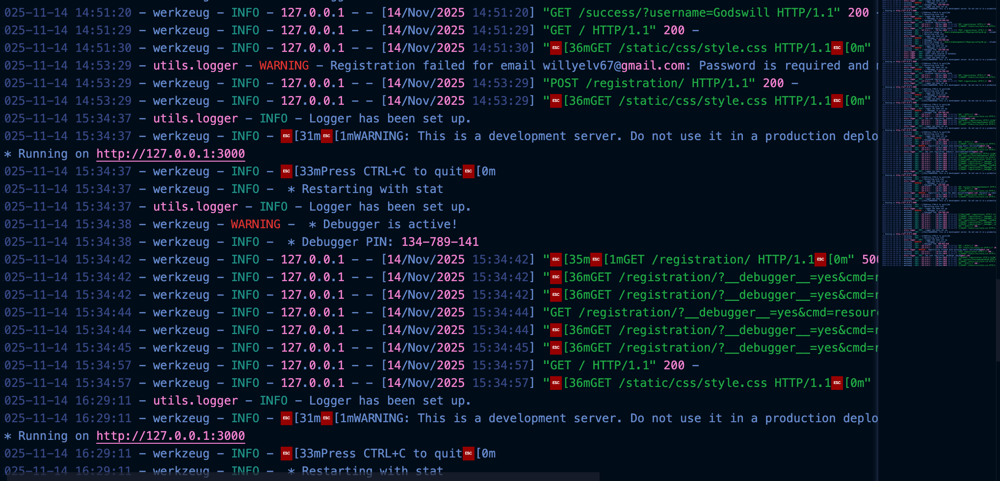

# Regilog-Core

[](https://www.python.org/) [](https://flask.palletsprojects.com/) [](LICENSE) []()

This project is a user registration system. Users can register with a username, email, and password. The application validates user input, hashes passwords, stores data in a SQLite database, and logs key events.

## Features

- User registration form
- Input validation (username, email, password length)
- Password hashing using Werkzeug
- SQLite database storage
- Flash messages for validation errors and success
- Logging system for tracking events and errors
- Automatic instance folder and database creation

## Project Structure

```

project/
│
├── app.py
├── config/
│   └── db.py
├── utils/
│   └── logger.py
├── images/
│   └── logs, screenshots, etc.
├── templates/
│   ├── register.html
│   └── success.html
├── instance/
│   └── user_registry.db
├── logs/
│   └── logfile.log
└── requirements.txt

````

## Getting Started

### 1. Clone the Repository

```bash
git clone https://github.com/your-username/Regilog-Core.git
cd Regilog-Core
````

### 2. Create and Activate a Virtual Environment

```bash
python3 -m venv venv
```

Activate:

```bash
# macOS/Linux
source venv/bin/activate

# Windows
venv\Scripts\activate
```

### 3. Install All Dependencies (including python-dotenv)

```bash
python3 -m pip install -r requirements.txt python-dotenv
```

### 4. Configure Environment Variables

Create a `.env` file in the root of the project:

```
SECRET_KEY="<YOUR_GENERATED_SECRET_KEY>"
```

Generate a secure secret key:

```bash
python -c 'import secrets; print(secrets.token_hex())'
```

## Database Initialization

The database is automatically created on first run, but you can manually initialize it:

```bash
python3 -c "from config.db import init_db; init_db()"
```

## Running the Application

```bash
python3 app.py
```

Access the app at:

```
http://127.0.0.1:3000/
```

## How It Works

| Process         | Description                                                 |
| --------------- | ----------------------------------------------------------- |
| Form Submission | User submits form data through POST                         |
| Data Handling   | The app reads the database, inserts the new user, and saves |
| Flash Message   | Confirms successful registration                            |
| Storage         | Data stored in `instance/user_registry.db`                  |
| Logs            | Application logs stored in `logs/logfile.log`               |

## Screenshots of Project

<div align="left">
  <p><b>Registration Form Interface</b></p>
  
</div>

<div align="left">
  <p><b>Flash Message After Registration</b></p>
  
</div>

<div align="left">
  <p><b>Flash Error Message After Registration</b></p>
  
</div>

<div align="left">
  <p><b>Stored User Data</b></p>
  
</div>

<div align="left">
  <p><b>Registration Form With Values</b></p>
  
</div>

<div align="left">
  <p><b>Data Logs In a File</b></p>
  
</div>

## Tech Stack

| Component | Technology            |
| --------- | --------------------- |
| Backend   | Python, Flask         |
| Frontend  | HTML, Bootstrap 5     |
| Storage   | SQLite                |
| Logging   | Python Logging Module |

## Contributing

Contributions are welcome. For UI changes, include a screenshot with your pull request.

## License

This project is licensed under the MIT License.

